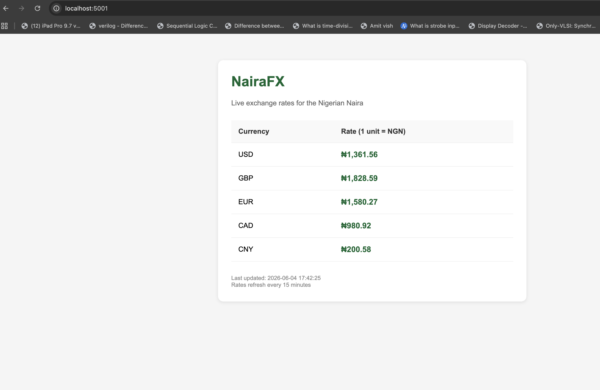

# NairaFX — Nigerian Naira Exchange Rate Tracker

A containerised web application that displays live exchange rates for the Nigerian Naira against major international currencies. Built to demonstrate the kind of FX rate display service that Nigerian banks and fintechs need on their customer-facing dashboards.

## What it does

NairaFX fetches current exchange rates from a public API and displays them in a clean web interface. Rates are cached in memory for 15 minutes to minimise upstream API calls. If the external API is unavailable, the app falls back to hardcoded values to ensure the page always loads.



## Why it's useful

Every Nigerian bank's internet banking and mobile app displays FX rates. Branch tellers consult them. Treasury teams update them. This is a real banking UI element built as a deployable, containerised web service.

## Technology Stack

- **Application**: Python 3.11, Flask 3.0
- **External API**: open.er-api.com (free public exchange rate API)
- **Containerisation**: Docker
- **Cloud Platform**: Microsoft Azure
- **Azure Services**: Azure Container Registry, Azure Container Instances

## Architecture patterns demonstrated

- **External API consumption with timeout handling** — the app calls a third-party service but never blocks indefinitely
- **In-memory caching** — frequently accessed data is cached to avoid hammering upstream services
- **Graceful degradation** — when the API fails, fallback values prevent a broken user experience
- **12-factor configuration** — all settings come from environment variables, not hardcoded
- **Health check endpoint** — `/health` returns service status for load balancers and monitoring

## Running Locally

```bash
git clone https://github.com/<yourusername>/nairafx.git
cd nairafx
docker build -t nairafx-app:v1 ./app
docker run -p 5000:5000 nairafx-app:v1
```

Visit `http://localhost:5000`.

## Deployment to Azure

The app is deployed to Azure Container Instances using the Azure CLI. The deployment uses Azure Container Registry to host the Docker image privately.

Deployment commands are in `docs/deployment.md`.

## Future Improvements

- Move the in-memory cache to Azure Cache for Redis for multi-instance scenarios
- Add Azure Application Insights for production monitoring and alerting
- Implement Terraform to manage Azure infrastructure as code
- Set up CI/CD with GitHub Actions to automate builds and deployments

## About

Built by Charles Ekaluo as part of a cloud engineering portfolio focused on banking and fintech use cases.

- LinkedIn: [Charles Ekaluo](https://www.linkedin.com/in/charles-e-804969299/)
